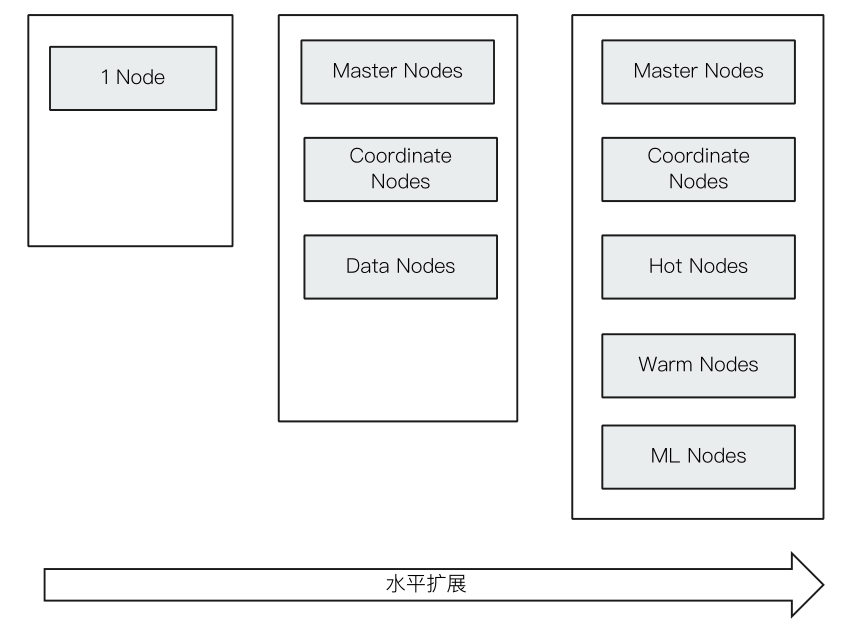

# Elasticsearch 简介及其发展历史
## 一、相关阅读
- 6.7 发布 https://www.elastic.co/cn/blog/elastic-stack-6-7-0-released?elektra=products&storm=sub2
- 7.0 发布 https://www.elastic.co/blog/elasticsearch-7-0-0-released
- X-Pack开源 https://www.elastic.co/products/x-pack/open
- Elasticsearch上市 https://www.elastic.co/blog/ze-bell-has-rung-thank-you-users-customers-and-partners

## 二、Elasticsearch 的分布式架构

- 集群规模可以从单个扩展至数百个节点
- 高可用 & 水平扩展
  - 服务和数据两个维度
- 支持不同的节点类型
  - 支持Hot & Warm架构

## 三、支持多种方式集成接入

- 多种编程语言类库(https://www.elastic.co/guide/en/elasticsearch/client/index.html)
  - Java  / .NET / Python / Ruby / PHP / Groovy / Perl
- RESTful API v.s Transport API
  - 9200 v.s 9300 (建议使用RESTful API)
- JDBC & ODBC

## 四、主要功能

- 海量数据的分布式存储以及集群管理
  - 服务于数据的高可用、水平扩展
- 近实时搜索、性能卓越
  - 结构化 / 全文 / 地理位置 / 自动完成
- 海量数据的近实时分析
  - 聚合功能

