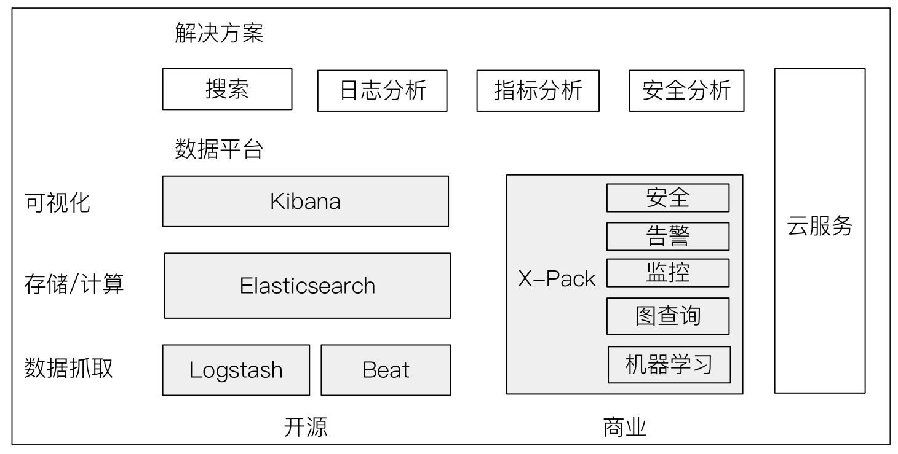
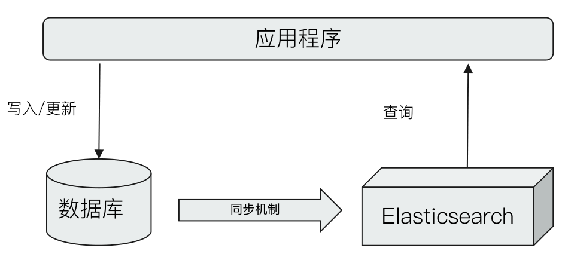

# Elastic Stack 家族成员与其应用场景
## 一、相关阅读
- https://www.elastic.co/cn/use-cases/
- https://www.objectrocket.com/blog/elasticsearch/top-elasticsearch-use-cases/
- https://hackernoon.com/elastic-stack-a-brief-introduction-794bc7ff7d4f
- https://dzone.com/articles/elk-stack-overview-and-the-need-for-it

## 二、Elastic Stack生态圈

### 2.1、Logstash：数据处理管道

- 开源的服务器端数据处理管道，支持从不同来源采集数据，转换数据，并将数据发送到不同的存储库中
- Logstash诞生于2009年，最初用来做日志的采集与处理
- Logstash创始人Jordan Sisel
- 2013年被Elasticsearch收购

### 2.3、Logstash特性

- 实时解析和转换数据
  - 从IP地址破译出地理坐标
  - 将PII数据匿名化，完全排除敏感字段
- 可扩展
  - 200多个插件(日志 / 数据库 / Arcsigh / Netflow)
- 可靠性安全性
  - Logstash会通过持久化队列来保证至少将运行中的事件送达一次
  - 数据传输加密
- 监控

### 2.4、kibana：可视化分析利器

- kibana名字的含义 = Kiwifruit + Banana
- 数据可视化工具，帮助用户解开对数据的任何疑问
- 基于Logstash的工具，2013年加入Elastic公司

### 三、Elastichsearch与数据库的集成

- 单独使用elasticsearch存储
- 以下情况可考虑与数据库集成
  - 与现有系统的集成
  - 需考虑事物性
  - 数据更新频繁

