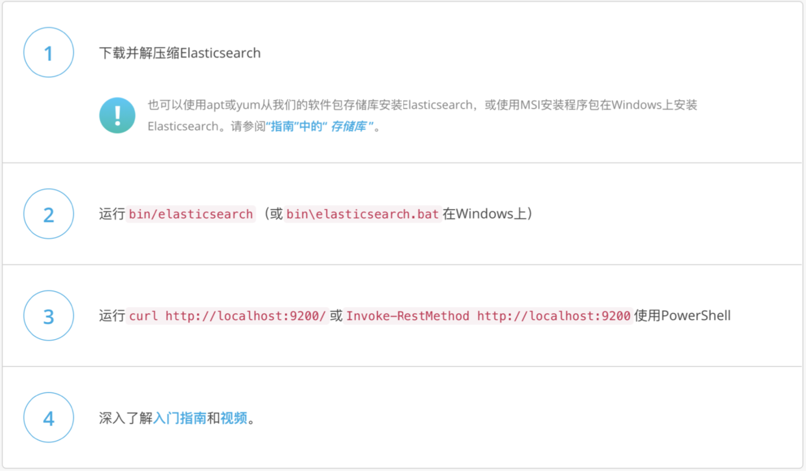
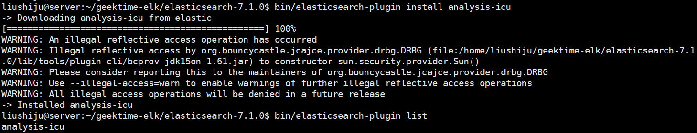

# Elasticsearch 的安装与简单配置

## 一、安装Java

- 运行Elasticsearch，需要安装并配置JDK
  - 设置`$JAVA_HOME`
- 各个版本对 Java 的依赖
  - elasticsearch 5 需要 Java 8 以上的版本
  - elasticsearch 从6.5 开始支持 Java 11
  - http://www.elastic.co/support/matrix#matrix_jvm
  - 7.0 开始，内置了 Java 环境

## 二、获取 Elasticsearch 安装包

- 下载二进制文件
  - https://www.elastic.co/cn/downloads/elasticsearch
- 支持 Docker 本地运行
- Helm chart for kubernetes
- Puppet Module

## 三、安装并运行 Elasticsearch



## 四、Elasticsearch的文件目录结构

| 目录    | 配置文件          | 描述                                                       |
| ------- | ----------------- | ---------------------------------------------------------- |
| bin     |                   | 脚本文件，包括启动 elasticsearch，安装插件。运行统计数据等 |
| config  | elasticsearch.yml | 集群配置文件，user，role based 相关配置                    |
| JDK     |                   | Java运行环境                                               |
| data    | path.data         | 数据文件                                                   |
| lib     |                   | Java 类库                                                  |
| logs    | path.log          | 日志文件                                                   |
| modules |                   | 包含所有 ES 模块                                           |
| plugins |                   | 包含所有已安装插件                                         |

## 五、JVM 配置

- 修改 JVM - config/jvm.options
  - 7.1 下载的默认设置是1GB
- 配置的建议
  - Xmx 和 Xms 设置成一样
  - Xmx 不要超过机器内存的 50%
  - 不要超过 30GB - https://www.elastic.co/blog/a-heap-of-trouble

## 六、下载并运行单个 Elasticsearch 实例

```bash
wget https://artifacts.elastic.co/downloads/elasticsearch/elasticsearch-7.1.0-linux-x86_64.tar.gz
tar -xf elasticsearch-7.1.0-linux-x86_64.tar.gz
cd elasticsearch-7.1.0
bin/elasticsearch

# 测试
curl -X GET http://127.0.0.1:9200/_cat/nodes

# 通过 -E 设定合适的参数
bin/elasticsearch -E node.name=node1 -E cluster.name=geektime -E path.data=node1_data

# 通过_cat/nodes查看节点
```

## 七、安装与查看插件



- Elasticsearch 提供插件的机制对系统进行扩展
  - Discovery Plugin
  - Analysis Plugin
  - Security Plugin
  - Management Plugin
  - Ingest Plugin
  - Mapper Plugin
  - Backup Plugin
- https://www.elastic.co/guide/en/elasticsearch/plugins/current/intro.html

## 八、如何在开发机上运行多个 Elasticsearch 实例

```bash
bin/elasticsearch -E node.name=node1 -E cluster.name=geektime -E path.data=node1_data -d
bin/elasticsearch -E node.name=node2 -E cluster.name=geektime -E path.data=node2_data -d
bin/elasticsearch -E node.name=node3 -E cluster.name=geektime -E path.data=node3_data -d
```

## 九、课程Demo

```
#启动单节点
bin/elasticsearch -E node.name=node0 -E cluster.name=geektime -E path.data=node0_data

#安装插件
bin/elasticsearch-plugin install analysis-icu

#查看插件
bin/elasticsearch-plugin list
#查看安装的插件
GET http://localhost:9200/_cat/plugins?v

#start multi-nodes Cluster
bin/elasticsearch -E node.name=node0 -E cluster.name=geektime -E path.data=node0_data
bin/elasticsearch -E node.name=node1 -E cluster.name=geektime -E path.data=node1_data
bin/elasticsearch -E node.name=node2 -E cluster.name=geektime -E path.data=node2_data
bin/elasticsearch -E node.name=node3 -E cluster.name=geektime -E path.data=node3_data

#查看集群
GET http://localhost:9200
#查看nodes
GET _cat/nodes
GET _cluster/health

```
## 相关阅读
- 安装指南 https://www.elastic.co/guide/en/elasticsearch/reference/7.1/install-elasticsearch.html
- Elastic Support Matrix(OS / JDK ) https://www.elastic.co/cn/support/matrix
- Elasticsearch 的一些重要配置 https://www.elastic.co/guide/en/elasticsearch/reference/current/important-settings.html
- https://www.elastic.co/guide/en/elasticsearch/reference/current/settings.html
- https://www.elastic.co/guide/en/elasticsearch/reference/current/important-settings.html
- Elasticsearch on Kuvernetes https://www.elastic.co/cn/blog/introducing-elastic-cloud-on-kubernetes-the-elasticsearch-operator-and-beyond
- CAT Plugins API https://www.elastic.co/guide/en/elasticsearch/reference/7.1/cat-plugins.html
