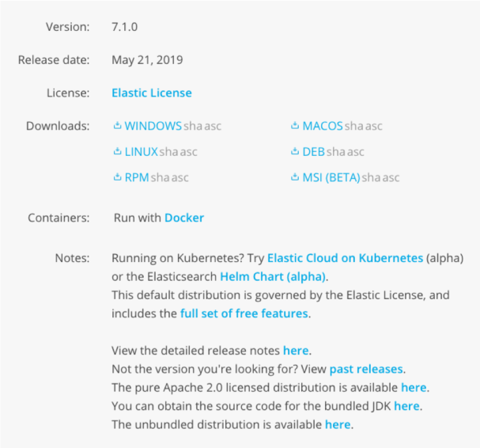
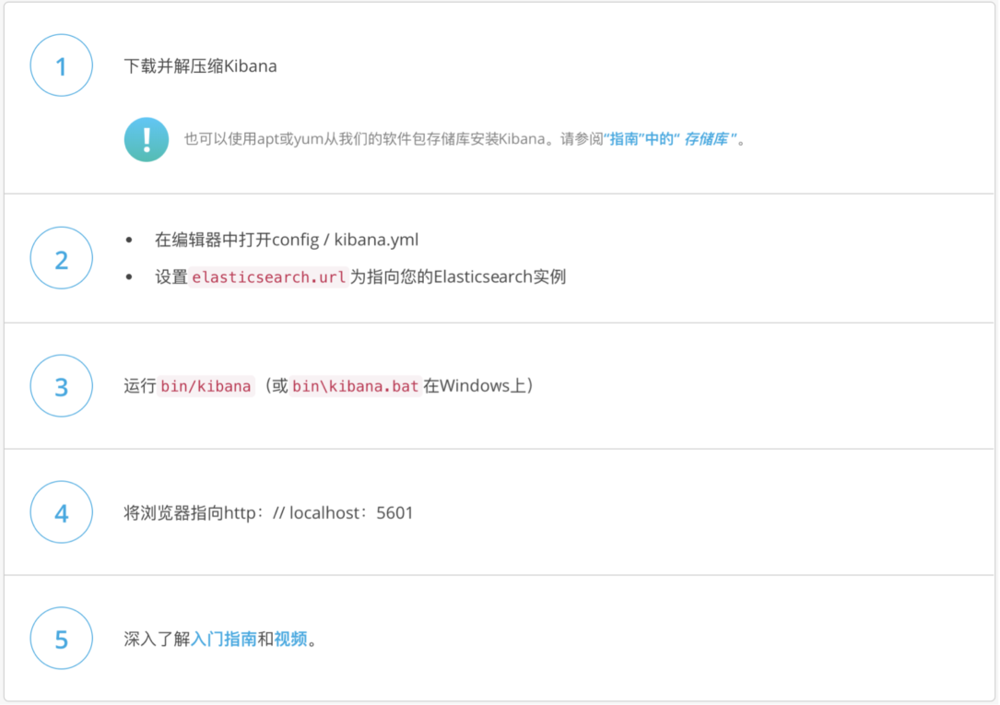

# Kibana 的安装与界面快速浏览

## 一、安装kibana



- 下载二进制文件 https://www.elastic.co/cn/downloads/kibana
- Docker 本地运行
- Helm chart for kubernetes
- Puppet Module

## 二、解压安装并运行 kibana



## 三、配置与运行

- 基于elasticsearch运行

- 本机无需修改配置，即可直接运行
- bin/kibana
- http://localhost:5601

## 四、Kibana Console

- Dev Tool
- Search Profiler
- Help + 一些快捷键
  - cmd + / （查看API帮助文档）

## 五、kibana plugins

- https://www.elastic.co/guide/en/kibana/current/known-plugins.html
- bin/kibana-plugin install  plugin_location
- bin/kibana-plugin list
- bin/kibana-plugin remove

## 课程Demo

```
#启动kibana
bin/kibana

#查看插件
bin/kibana-plugin list

```
## 相关阅读
- https://www.elastic.co/guide/en/kibana/current/setup.html
- Kibana 相关插件 https://www.elastic.co/guide/en/kibana/current/known-plugins.html
