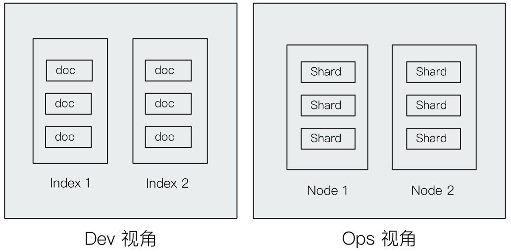
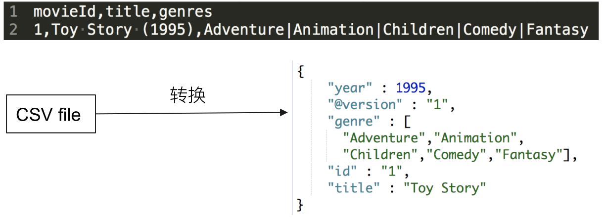
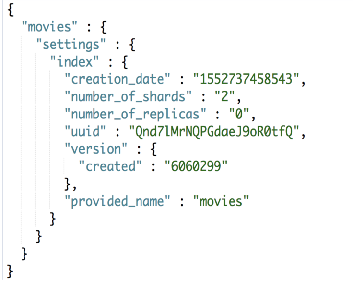
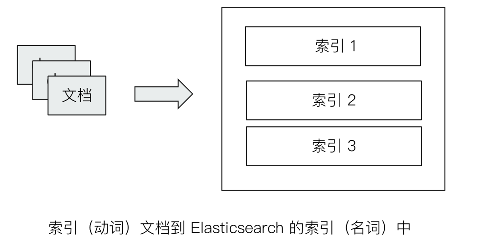
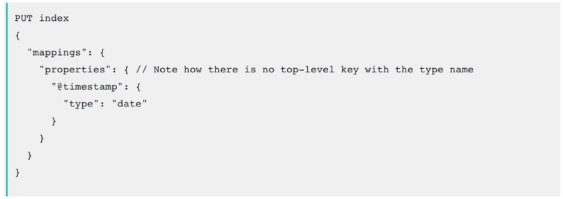
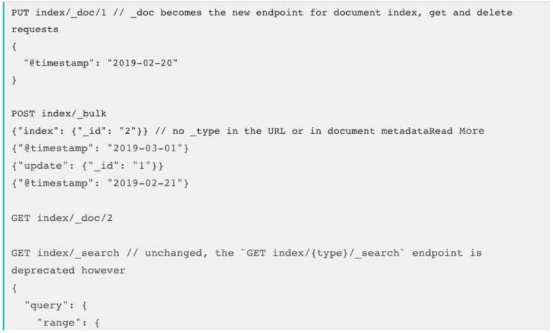
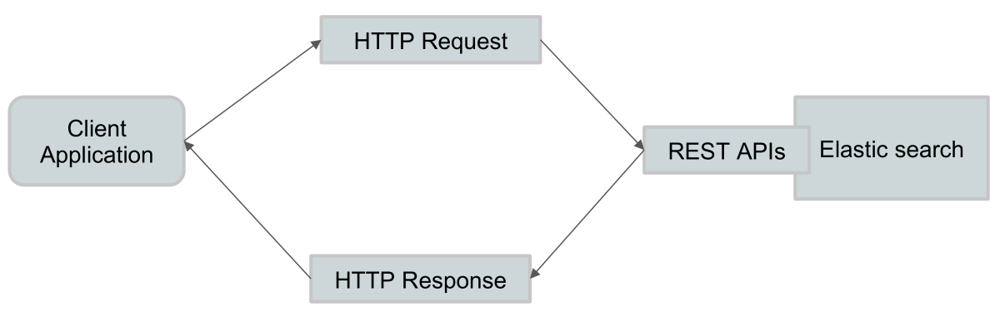

# 基本概念(1)- 索引，文档和 REST API

## 一、Elasticsearch 基本概念



- Index 索引
  - Type 类型
  - Document 文档
- Node 节点
  - Shard 分片

## 二、文档(Document)

- Elasticsearch 是面向文档的，文档是所有**可搜索数据的最小单位**
  - 日志文件中的日志项
  - 一本电影的具体信息 / 一张唱片的详细信息
  - MP3播放器里的一首歌 / 一篇 PDF 文档中的具体内容
- 文档会被序列化成 JSON 格式，保存在 elasticsearch 中
  - JSON 对象由字段组成
  - 每个字段都有对应的字段类型(字符串 / 数值 / 布尔 / 日期 / 二进制 / 范围类型)
- 每个文档都有一个 Unique ID
  - 你可以自己指定ID
  - 或者通过 Elasticsearch 自动生成

### 2.1、JSON 文档

- 一篇文档包含了一系列的字段。类似数据库表中一条记录
- JSON 文档，格式灵活，不需要预先定义格式
  - 字段的类型可以指定或者通过 elasticsearch 自动推算
  - 支持数组 / 支持嵌套



### 2.2、文档的元数据

- 元数据，用于标注文档的相关信息
  - _index ：文档所属的索引名
  - _type： 文档所属的类型名
  - _id：文档唯一 ID
  - _source：文档的原始JSON数据
  - _all：整合所有字段内容到该字段，已被废除
  - _version：文档的版本信息
  - _score：相关性打分


## 三、索引

- Index：**索引是文档的容器，是一类文档的结合**
  - Index 体现了逻辑空间的概念：每个索引都有自己的 **Mapping** 定义，用于定义**包含的文档的字段和字段类型**
  - Shard 体现了物理空间的概念：索引中的数据分散在 Shard 上
- 索引的 Mapping 与 Settings
  - Mapping 定义文档字段的类型
  - Setting 定义不同的数据分布



### 3.1、索引的不同语意



- 名词：一个 elasticsearch 集群中，可以创建很多个不同的索引
- 动词：保存一个文档到 elasticsearch 的过程也叫索引(indexing)
  - ES 中，创建一个倒排索引的过程
- 名词：一个 B 树索引，一个倒排索引

### 3.2、Type

- 在7.0 之前，一个 Index 可以设置多个 Types
- 6.0 开始，Type 已经被 Deprecated。7.0开始，一个索引只能创建一个 Type : "_doc"





## 四、抽象与类比

- 在7.0 之前，一个 Index 可以设置多个 Types
- 目前Type 已经被 Deprecated。7.0开始，一个索引只能创建一个 Type : "_doc"
- 传统关系型数据库和Elasticsearch 的区别
  - Elasticsearch - Schemaless / 相关性 / 高性能全文检索
  - RDMS - 事务性 / Jion

| RDBMS  | Elasticsearch |
| :----: | :-----------: |
| Table  |  Index(Type)  |
|  Row   |   Document    |
| Column |     Filed     |
| Schema |    Mapping    |
|  SQL   |      DSL      |

## 五、REST API 很容易被各种语言调用



## 六、一些基本的 API

- Indices
  - 创建 Index
    - PUT Movies
  - 查看所有 Index
    - _cat/indices

## 课程Demo

- 需要通过Kibana导入Sample Data的电商数据。具体参考“[2.2节-Kibana的安装与界面快速浏览](../2.2-Kibana的安装与界面快速浏览/README.md)”

Index 相关 API
```bash
#查看索引相关信息
GET kibana_sample_data_ecommerce

#查看索引的文档总数
GET kibana_sample_data_ecommerce/_count

#查看前10条文档，了解文档格式
POST kibana_sample_data_ecommerce/_search
{
}

#_cat indices API
#查看indices
GET /_cat/indices/kibana*?v&s=index

#查看状态为绿的索引
GET /_cat/indices?v&health=green

#按照文档个数排序
GET /_cat/indices?v&s=docs.count:desc

#查看具体的字段
GET /_cat/indices/kibana*?pri&v&h=health,index,pri,rep,docs.count,mt

#How much memory is used per index?
GET /_cat/indices?v&h=i,tm&s=tm:desc

```


## 相关阅读
- 为什么不再支持单个Index下，多个Tyeps https://www.elastic.co/cn/blog/moving-from-types-to-typeless-apis-in-elasticsearch-7-0
- CAT Index API https://www.elastic.co/guide/en/elasticsearch/reference/7.1/cat-indices.html
